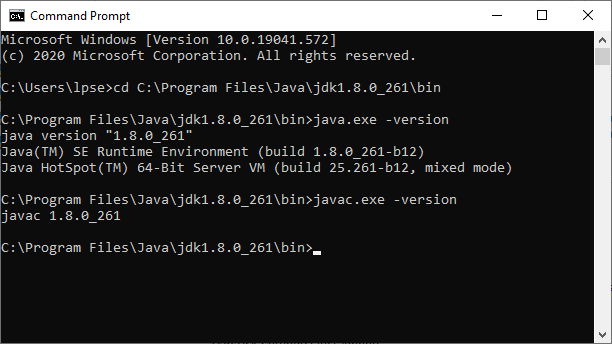
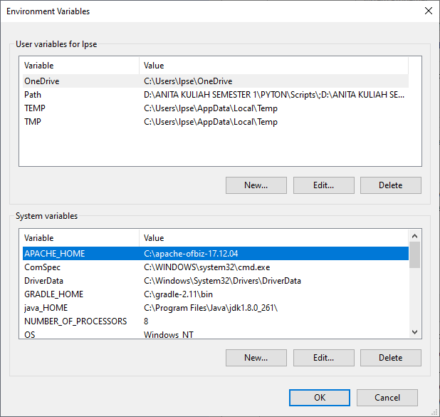
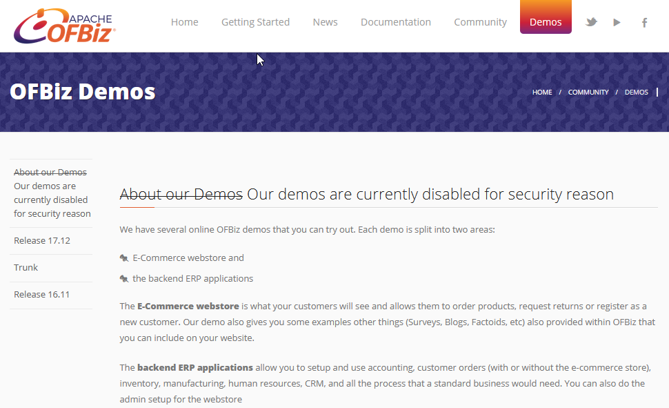

Software yang digunakan Windows, Java JDK 8, Apache OFBiz

langkah pertama yang dilakukan, instal Java JDK 8

Selanjutnya setting javac

selanjutnya extract file gradle

setup environment di gradle

KELEBIHAN APACHE SERVE

1. Freeware (software gratis)

2. Mudah di-install.

3. Mampu beroperasi pada berbagai platform sistem operasi.

4. Mudah mengkonfigurasinya.

5. Mudah dalam menambahkan periferal lainnya ke dalam platform web servernya.

6. Menyediakan feature untuk multihomed dan virtual server.

7. Mempunyai dukungan teknis melalui web.

8. Mempunyai kompatibilitas platform yang tinggi.

Mencoba demo, E-Commerce webstore atau backend ERP

