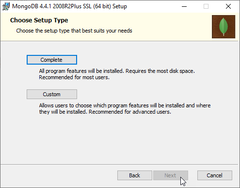

## Install Go

Unduh di https://golang.org/doc/install?download=go1.15.3.windows-amd64.msi

step 1

step 2

step 3

step4

step5

step 6

ujicoba hasil instalasi go

## Install MySQL

unduh di  https://dev.mysql.com/get/Downloads/MySQLInstaller/mysql-installer-web-community-8.0.21.0.msi

## Install MongoDB Community Server

unduh di https://www.mongodb.com/try/download/community

