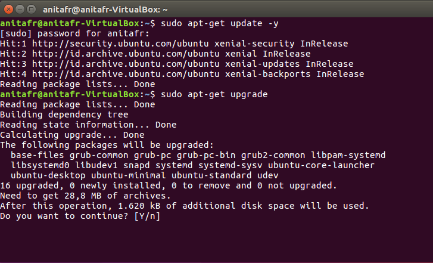
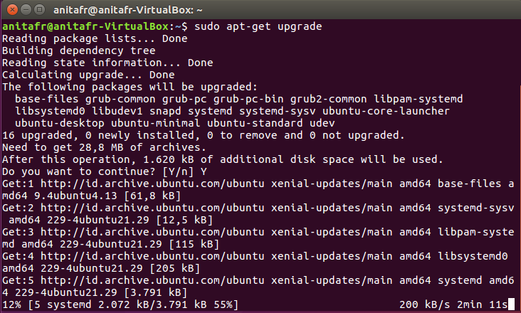
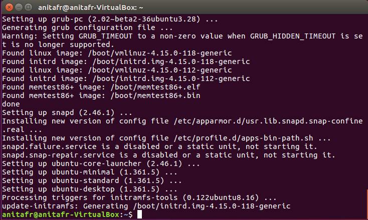

# Instalasi Docker

## 1.Update OS Ubuntu
Perbarui perangkat ke versi terbaru dengan menggunakan command berikut :

Sudo apt-get update -y

Sudo apt-get upgrade

## 2.Membuat Protokol Repositori yang Baru
Buat protokol baru di HTTPS dengan menambahkan command berikut :
Sudo apt-get install software-properties-common -y

## 3.Import Command dengan Curl
Langkah selanjutnya adalah mengimpor command dengan menggunakan GPG Key beserta command curl.
Curl -fsSL https://download.docker.com/linux/ubuntu/gpg | sudo apt-key add -

## 4.Install Community Edition
Setelah Docker berhasil diaktifkan, selanjutnya install community edition
Sudo apt-get update
Sudo apt-get install docker-ce

## 5.Verifikasi Instalasi
Pastikan Docker Compose telah berhasil diinstall.
Sudo systemctl status docker

### 6.Cara Cek Versi Docker

docker -v

