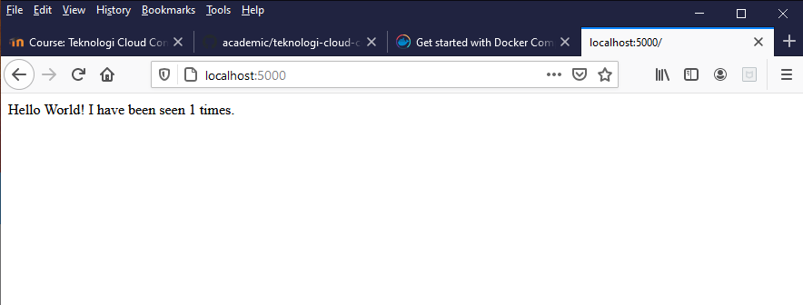
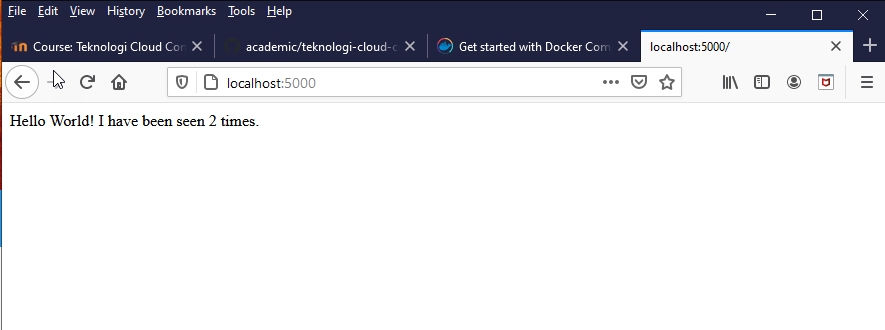
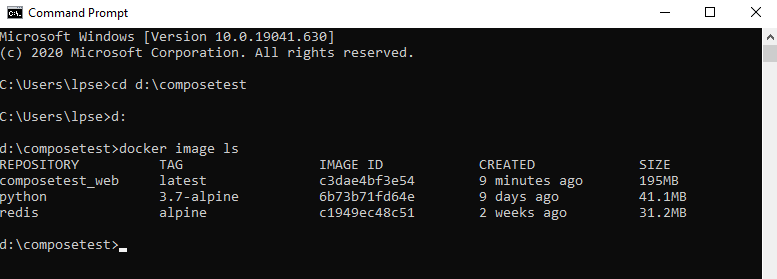
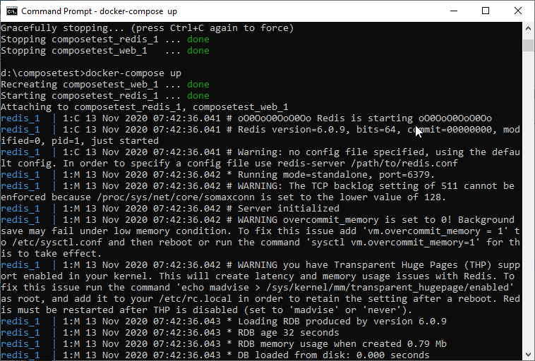
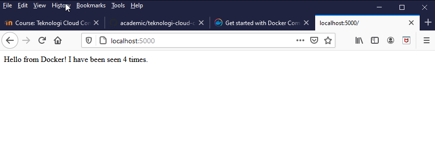
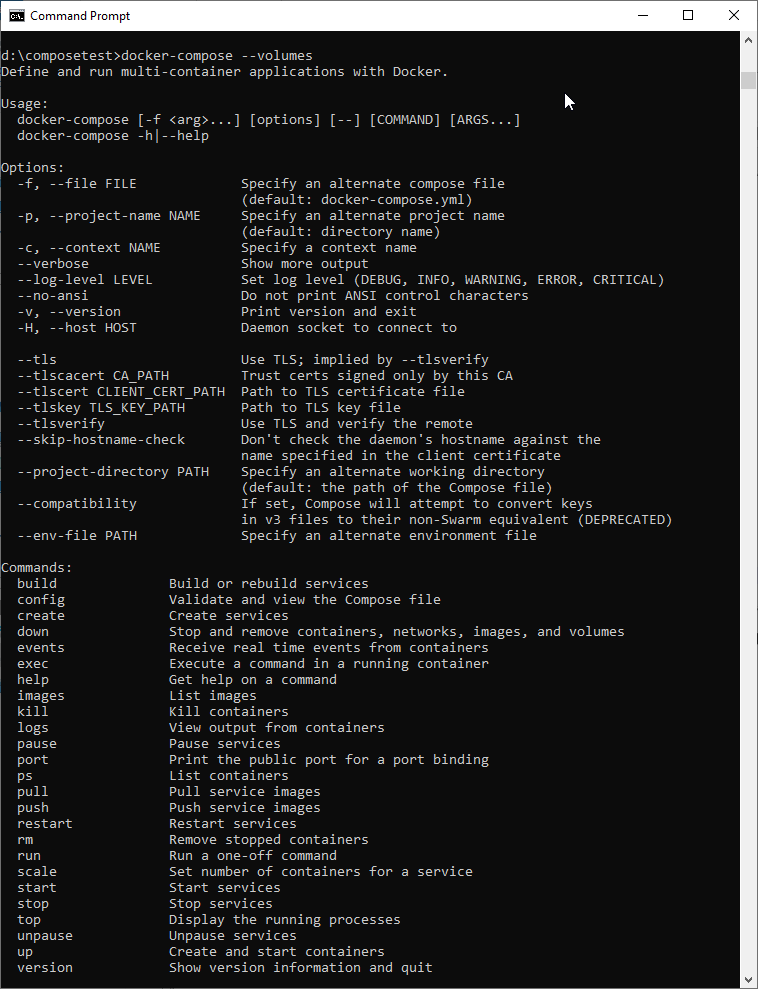

# Docker Compose

## Langkah 1 : Setup

1. membuat sebuah direktori untuk project

2. membuat file app.py pada direktori project

3. membuat file requirement.txt

flask
redis

## Langkah 2 : Membuat Dockerfile

membuat file Dockerfile

## Langkah 3 : Define services in a Compose file

membuat dile docker-compose.yml

## Langkah 4 : Build and run your app with Compose

1. dari direktori project jalankan perintah docker-compose up

2. jalankan http://localhost:5000 pada browser

3. refresh halaman tersebut

4. berpindah terminal window yang lain docker image ls

5. untuk berhenti dengan perintah docker-compose down atau tekan ctrl+C

## Step 5 : Edit the Compose file to add a bind mount

edit file docker-compose.yml

## Step 6 : Re-build and run the app with Compose

dari direktori project jalankan perintah docker-compose up

cekHello World pada browser

## Step 7 : Update aplikasi

ubah greeting Hello World! di file app.py menjadi Hello from Docker!

refresh browser

## Langkah 8 : Experiment with some other commands

