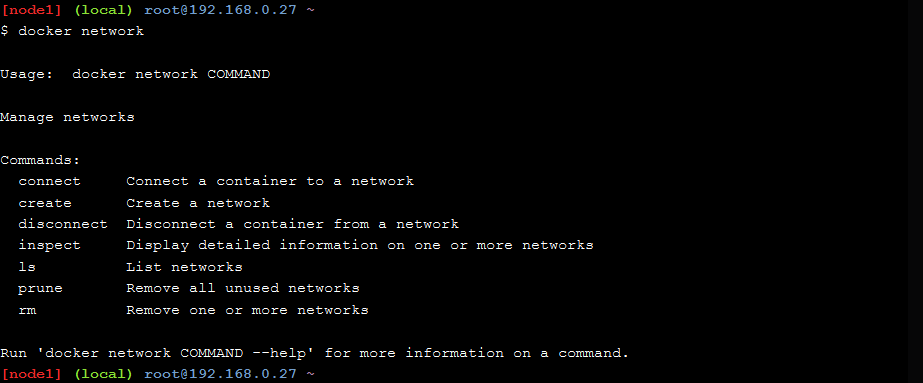
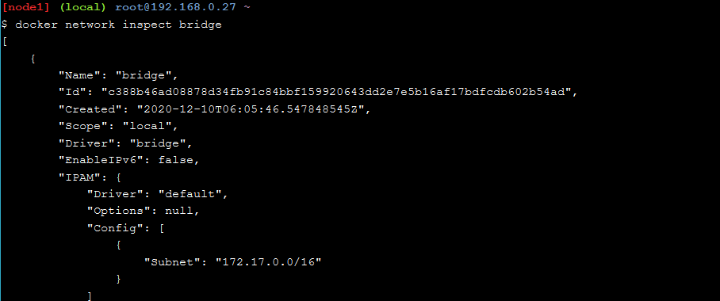
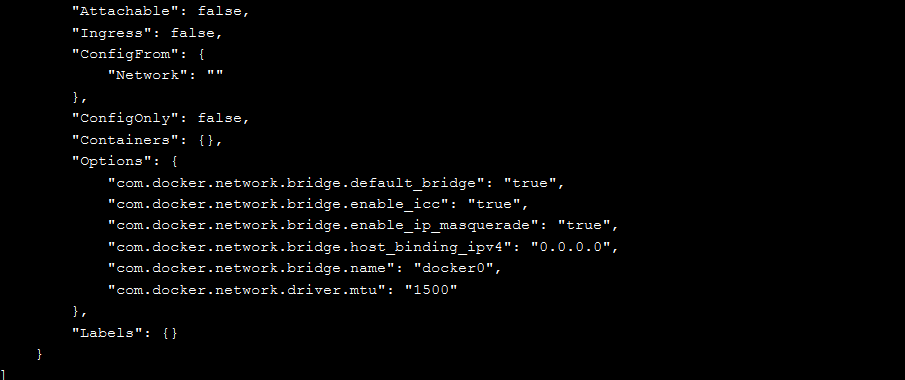
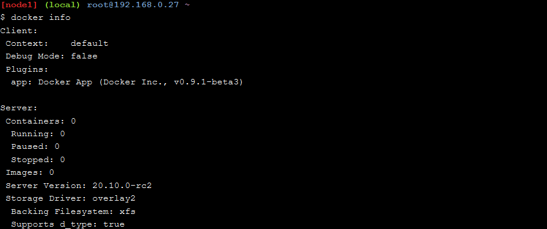
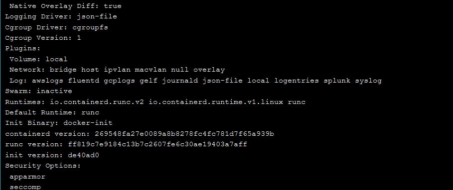
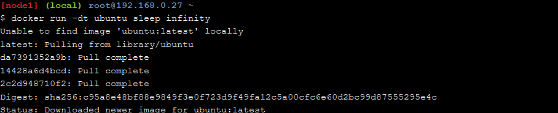
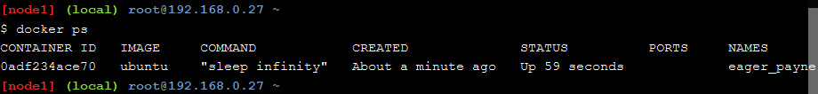
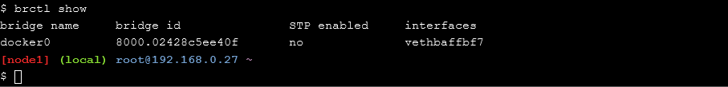

# Docker Networking

## Section #1 - Networking Basics

Step 1: The Docker Network Command

Step 2: List networks

Step 3: Inspect a network

Step 4: List network driver plugins

## Section #2 - Bridge Networking

Step 1: The Basics

Step 2: Connect a container

Step 3: Test network connectivity

Step 4: Configure NAT for external connectivity

