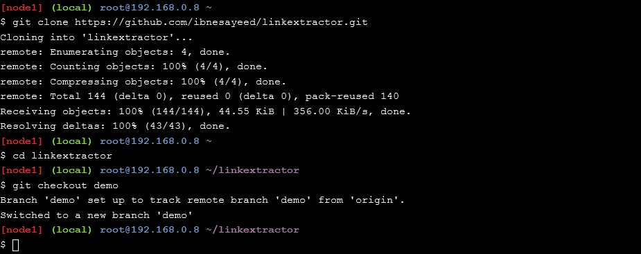
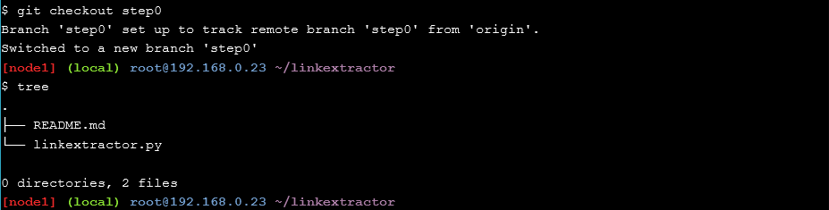
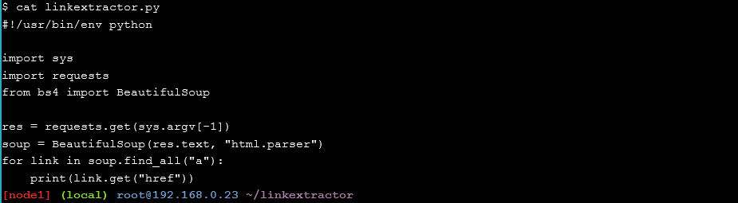
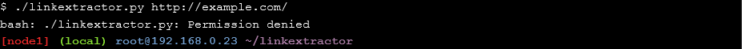
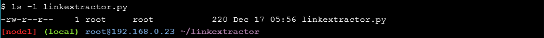
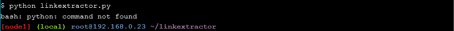

# Application Containerization and Microservice Orchestration

## Stage Setup

## Step 0: Basic Link Extractor Script
    
   

    
## Step 1: Containerized Link Extractor Script
    
    
    
## Step 2: Link Extractor Module with Full URI and Anchor Text
    
    
    
## Step 3: Link Extractor API Service
    
    
    
## Step 4: Link Extractor API and Web Front End Services
    
    
    
## Step 5: Redis Service for Caching
    
    
    
## Step 6: Swap Python API Service with Ruby
    
    
    
## Conclusions

