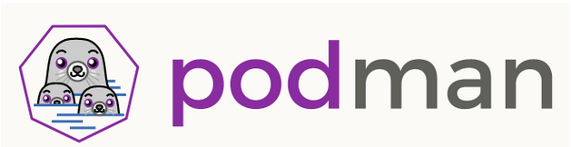

# PODMAN

What is Podman?

What is Podman? Well, we will start by saying that Podman is a container engine developed by RedHat, and yes, if you thought about Docker when reading container engine, you are on the right track.

Podman wants to be the alternative to the well-known container Docker engine, but you may wonder: what does RedHat offer through Podman? Why should I switch to Podman? Is Podman the replacement for Docker or just another competitor? Although we just answered “what is Podman?”, it is still early to answer all these questions, but in this article we will try to describe what Podman’s wildcards to dethrone the current king of the containers are.

